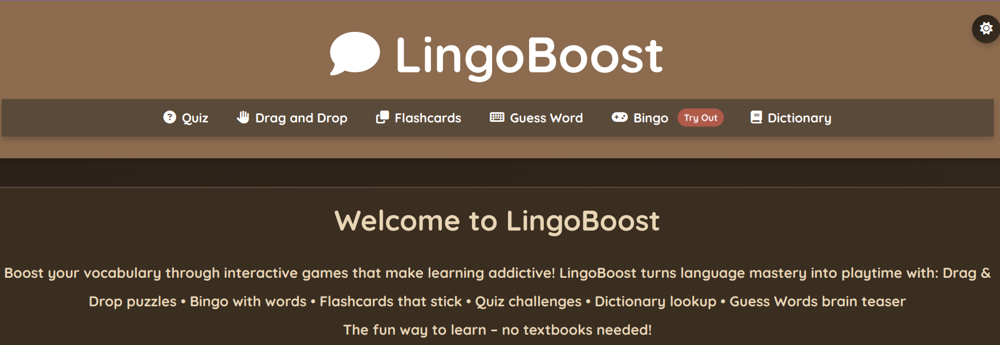
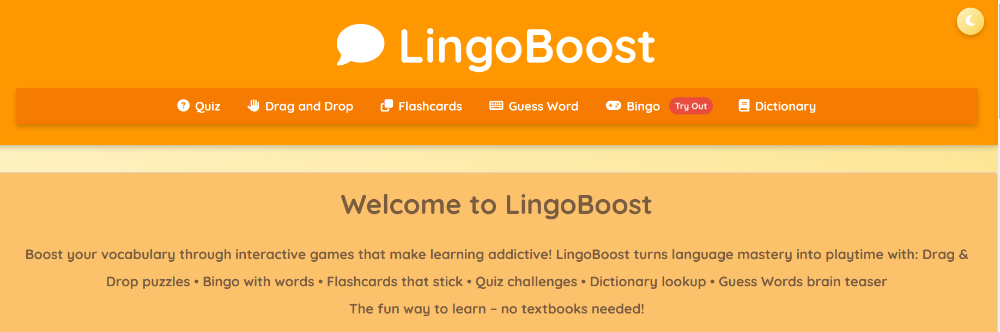
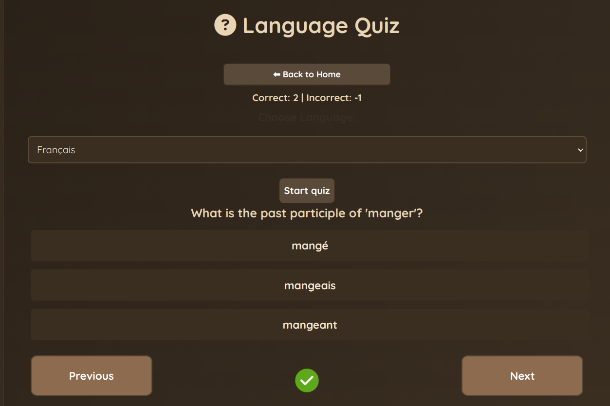
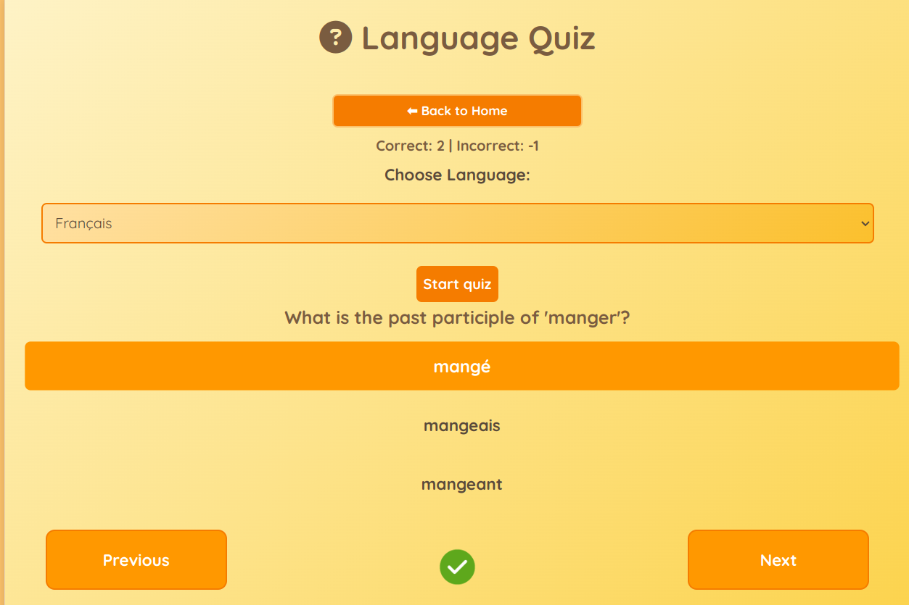
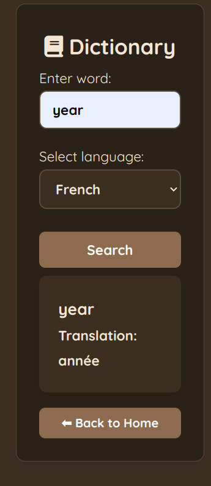
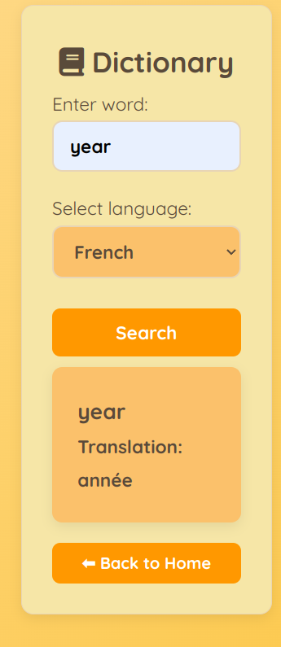
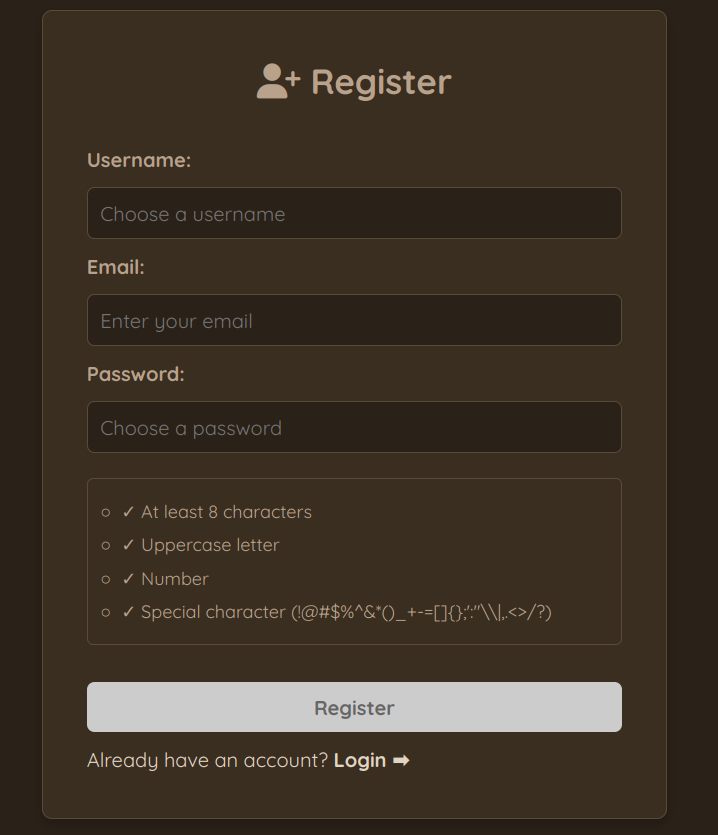
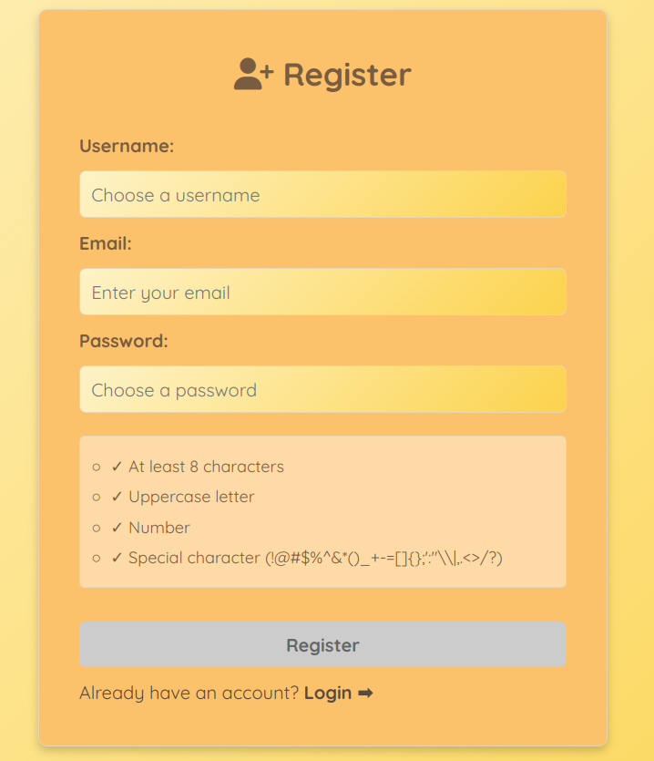

# 🚀 LingoBoost - Interactive Language Learning Platform

## 🌟 Project Overview

LingoBoost is a modern web application that makes language learning fun and engaging through gamified experiences. It offers various interactive modules to help users master vocabulary in multiple languages.


<p align="center">
  
  
</p>


---

## 🛠️ Technology Stack

### Frontend Technologies

| Technology       | Purpose                 | Badge                                                                 |
|------------------|-------------------------|-----------------------------------------------------------------------|
| HTML5            | Structure & Content     |  |
| CSS3             | Styling & Layout        |  |
| JavaScript (ES6+)| Interactivity & Logic   |  |
| Font Awesome     | Icons                   |  |

### Backend Technologies

| Technology       | Purpose                 | Badge                                                                 |
|------------------|-------------------------|-----------------------------------------------------------------------|
| Node.js          | Runtime Environment     |  |
| Express.js       | API Framework           |  |
| MongoDB          | Database                |  |

### Third-Party Services

| Service          | Purpose                 | Badge                                                                 |
|------------------|-------------------------|-----------------------------------------------------------------------|
| EmailJS          | Contact Form Handling   |  |
| YouTube API      | Video Lessons           |  |

---

## 🏃‍♂️ How to Run the Project

### Prerequisites
✔ Modern web browser (Chrome, Firefox, Edge, Safari)  
✔ Internet connection (for API access)

### Running Locally

1. **Clone the repository**:
   ```bash
   git clone https://github.com/zwezdica/lingoboost_frontend.git
   cd lingoboost

## 🏃‍♂️ Development Setup

### Prerequisites
- Node.js (v14 or higher)
- Modern web browser (Chrome, Firefox, Edge)

### Running Locally

1. **Install dependencies**:
   ```bash
   npm install
Start development server:

2. **Start development server**:
   ```bash
   npm start

3. **or using http-server**:
  ```bash
  npx http-server
```

4. **Access the application**:
Open http://localhost:5000 in your browser


## 📂 Project Structure
lingoboost-module/    
├── public/        
│ ├── css/          
│ ├── img/          
│ ├── src/              
│ │ ├── auth/              
│ │ │ ├── admin/               
│ │ │ │ ├── admin.api.js                 
│ │ │ │ ├── admin.events.js              
│ │ │ │ ├── admin.ui.js            
│ │ │ │ └── admin.js            
│ │ │ ├── login/               
│ │ │ ├── register/                    
│ │ │ ├── auth.api.js                 
│ │ │ ├── auth.constants.js                    
│ │ │ ├── auth.events.js               
│ │ │ └── auth.ui.js                     
│ │ └── features/                                      
│ │ ├── bingo/
│ │ │ ├── bingo.api.js                 
│ │ │ ├── bingo.constants.js                 
│ │ │ ├── bingo.events.js                     
│ │ │ ├── bingo.game.js                      
│ │ │ ├── bingo.ui.js                     
│ │ │ └── bingo.utils.js                   
│ │ ├── dictionary/                         
│ │ ├── dragdrops/                    
│ │ ├── flashcards/                      
│ │ ├── guesswords/                      
│ │ ├── home/                      
│ │ └── quiz/                      
│ ├── admin.html                          
│ ├── bingo.html                        
│ ├── dictionary.html                        
│ ├── dragdrops.html                      
│ ├── flashcards.html                           
│ ├── guesswords.html                          
│ ├── index.html                      
│ ├── login.html                   
│ ├── quiz.html                 
│ └── register.html                       

     

## ✨ Features

### 🎮 Interactive Learning Games
- 🎲 Bingo vocabulary game
- 🖱️ Drag & Drop matching
- 🔤 Digital flashcards
- ❓ Word guessing challenges
- 📝 Language quizzes
  <p align="center">
  
      
      <br>
  <em>Language quiz interface in both color modes</em>
</p>


### 📚 Comprehensive Dictionary
- 🔍 Word search functionality
- 🌐 Multiple language support

<p align="center">
  
    
    <br>
  <em>Dictionary search results comparison</em>
</p>

### 👤 User System
- 🔐 Secure authentication
- ⚙️ Admin dashboard

  <p align="center">
  
     
      <br>
  <em>User registration form with password requirements</em>
</p>


## ➕ Additional Features
- 🌙 Dark/light mode toggle

- 🌐 Language selector (persists across sessions)

- 📱 Responsive design

- 💫 Interactive UI elements

- ✉️ Contact form with email integration
